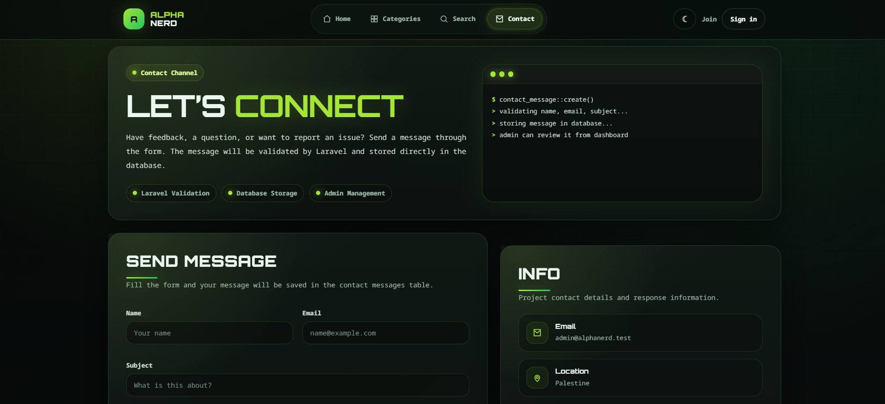
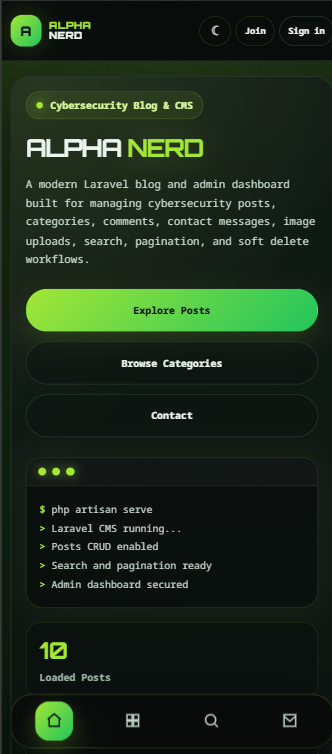
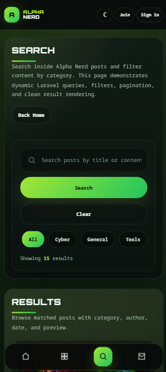
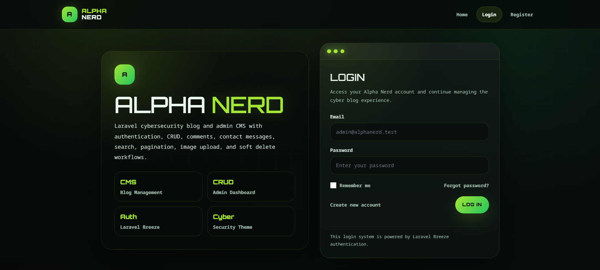
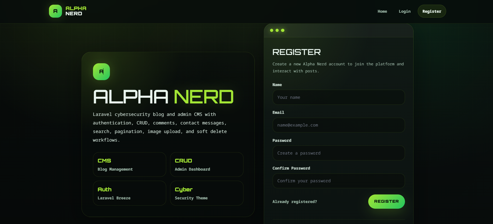

# Alpha Nerd — Laravel Blog & Admin Dashboard

Alpha Nerd is a Laravel portfolio project that combines a public cybersecurity-style blog with an admin dashboard. The project includes authentication, admin-only management pages, posts, categories, comments, contact messages, image uploads, search, pagination, soft delete workflows, dark/light mode, and responsive mobile-friendly UI.

**Live Demo:** https://alpha-nerd-blog-project.onrender.com  
**Repository:** https://github.com/ahmedMhamdan/alpha-nerd-blog-project

---

## Project Overview

Alpha Nerd was built as a practical Laravel project to demonstrate real backend development concepts in a complete web application. The public website allows visitors to browse posts, filter content by category, search through posts, read single post pages, and send contact messages. The admin dashboard allows authorized admins to manage the main website content through CRUD operations and soft delete workflows.

The project was also deployed online using a production-like flow:

```text
GitHub → Render Docker Web Service → Laravel App → Neon PostgreSQL Database
```

---

## Key Features

### Public Website

- Responsive homepage
- Mobile-friendly public layout
- Dark/light mode support
- Posts listing
- Single post details page
- Categories page with category filtering
- Search page with keyword and category filtering
- Contact page
- Contact form with server-side validation
- Contact messages stored in the database
- Post comments display
- Pagination for larger post lists

### Admin Dashboard

- Admin dashboard overview with statistics
- Posts CRUD
- Categories CRUD
- Comments management
- Contact messages management
- Soft delete archive pages
- Restore deleted records
- Force delete records permanently
- Image upload for posts
- Admin dashboard dark/light mode
- Mobile-responsive dashboard tables and cards

### Authentication & Authorization

- Laravel Breeze authentication
- Login page
- Register page
- Forgot password page
- Change password page
- Protected dashboard routes
- Admin-only access to management pages
- Middleware-based admin protection
- CSRF protection through Laravel forms

### Deployment

- Docker-based deployment on Render
- PostgreSQL production database on Neon
- Production environment variables configured in Render
- Automatic migrations during deployment
- One-time production seeding workflow
- HTTPS URL handling for production assets

---

## Screenshots
### Public Website

#### Homepage


#### Single Post Page


#### Post Comments


#### Categories Page


#### Search Page


#### Contact Page


### Mobile Responsive Screenshots



### Authentication Pages

#### Login Page


#### Register Page


#### Forgot Password Page


#### Change Password Page


### Admin Dashboard

#### Dashboard Overview


#### Posts Management


#### Create Post


#### Edit Post


#### Deleted Posts


#### Categories Management


#### Create Category


#### Edit Category


#### Deleted Categories


#### Contact Messages Management


#### Deleted Messages


---

## Tech Stack

- Laravel 13
- PHP 8+
- Blade templates
- Laravel Breeze
- Eloquent ORM
- MySQL for local development
- PostgreSQL / Neon for production
- HTML
- CSS
- JavaScript
- Docker
- Render deployment
- Git & GitHub

---

## Main Database Tables

- `users`
- `posts`
- `categories`
- `comments`
- `contact_messages`

---

## Local Installation

Clone the repository:

```bash
git clone https://github.com/ahmedMhamdan/alpha-nerd-blog-project.git
```

Move into the project folder:

```bash
cd alpha-nerd-blog-project
```

Install PHP dependencies:

```bash
composer install
```

Install frontend dependencies:

```bash
npm install
```

Create the environment file:

```bash
cp .env.example .env
```

Generate the Laravel application key:

```bash
php artisan key:generate
```

Configure your local database in `.env`:

```env
DB_CONNECTION=mysql
DB_HOST=127.0.0.1
DB_PORT=3306
DB_DATABASE=alpha_nerd
DB_USERNAME=root
DB_PASSWORD=
```

Run migrations and seeders:

```bash
php artisan migrate --seed
```

Run the frontend development server:

```bash
npm run dev
```

In another terminal, start Laravel:

```bash
php artisan serve
```

Open the project locally:

```text
http://127.0.0.1:8000
```

---

## Production Deployment Notes

This project was deployed on Render using Docker and connected to a Neon PostgreSQL database.

### Important Production Environment Variables

Set these variables in Render, not in GitHub:

```env
APP_NAME=Alpha Nerd
APP_ENV=production
APP_DEBUG=false
APP_URL=https://alpha-nerd-blog-project.onrender.com
APP_KEY=base64:your-generated-app-key

DB_CONNECTION=pgsql
DB_HOST=your-neon-host
DB_PORT=5432
DB_DATABASE=neondb
DB_USERNAME=your-neon-username
DB_PASSWORD=your-neon-password
DB_SSLMODE=require

PORT=80
```

### Generate `APP_KEY`

Run locally:

```bash
php artisan key:generate --show
```

Copy the generated value into Render as `APP_KEY`.

### Docker Deployment Files

The deployment uses:

```text
Dockerfile
apache.conf
start.sh
```

`Dockerfile` builds the PHP/Apache environment, installs Composer dependencies, installs frontend packages, and builds production assets.

`apache.conf` points Apache to Laravel's `public` directory.

`start.sh` clears Laravel cache, runs migrations, caches production files, and starts Apache.

Final `start.sh` should not include the seeder command:

```bash
#!/usr/bin/env bash
set -e

php artisan config:clear
php artisan route:clear
php artisan view:clear

php artisan migrate --force

php artisan config:cache
php artisan route:cache
php artisan view:cache

apache2-foreground
```

### Seeding Production Data

The seeder should only be run once in production. If needed, temporarily add this line to `start.sh`:

```bash
php artisan db:seed --force
```

Deploy once, confirm the data was inserted, then remove the line and deploy again. Keeping the seeder command permanently may duplicate posts, categories, or users after every restart/deploy.

---

## Frontend Assets Note

The project uses a mix of public assets and Laravel Breeze/Vite assets.

Public website assets are mainly stored in:

```text
public/site
public/posts
public/screenshots
```

If images are stored directly in `public/posts`, `php artisan storage:link` is not required for those uploaded post images.

For Breeze/Vite assets:

```bash
npm install
npm run dev
```

For production builds:

```bash
npm run build
```

---

## Project Structure Highlights

```text
app/Models              Eloquent models
app/Http/Controllers    Public and admin controllers
database/migrations     Database schema files
database/seeders        Initial demo data
resources/views/site    Public website Blade views
resources/views/admin   Admin dashboard Blade views
public/site             Public website CSS/assets
public/admin            Admin dashboard custom CSS/assets
public/posts            Uploaded/seeded post images
routes/web.php          Public, auth, and admin routes
```

---

## Development Workflow

Typical workflow for future updates:

```bash
git status
git add .
git commit -m "Your commit message"
git push origin main
```

Then deploy the latest commit from Render if auto-deploy is not enabled.

---

## Project Purpose

This project was built as a Laravel portfolio project to practice and demonstrate:

- Routing
- Controllers
- Models
- Migrations
- Seeders
- Eloquent relationships
- Authentication
- Authorization
- CRUD operations
- Form validation
- File uploads
- Pagination
- Search and filtering
- Soft delete workflows
- Responsive UI design
- Production deployment basics

It also reflects secure web development basics such as protected admin routes, request validation, CSRF protection, authenticated access, and role-based dashboard access.

---

## Authors

Ahmed  
Fadi  
4th-year Cybersecurity students at UCAS  
Interested in Laravel backend development, secure web applications, and cybersecurity.
